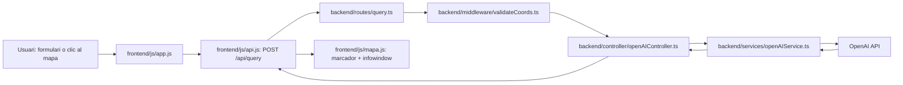

# OpenIA-Maps

> Consultes geogràfiques intel·ligents amb OpenAI i visualització directa sobre Google Maps.

[](https://nodejs.org/)
[](https://www.typescriptlang.org/)
[](https://expressjs.com/)
[](https://openai.com/)
[](https://developers.google.com/maps)

## Taula de continguts

- [Visio General](#visio-general)
- [Stack Tecnologic](#stack-tecnologic)
- [Estructura del Projecte](#estructura-del-projecte)
- [Arquitectura i Flux](#arquitectura-i-flux)
- [API Backend](#api-backend)
- [Instal lacio i Arrencada](#instal-lacio-i-arrencada)
- [Configuracio d'Entorn](#configuracio-d-entorn)
- [Exemples d'Us](#exemples-d-us)
- [Troubleshooting](#troubleshooting)
- [Seguretat i Bones Practiques](#seguretat-i-bones-practiques)
- [Contribucio](#contribucio)
- [Llicencia](#llicencia)

---

## Visio General

OpenIA-Maps combina un backend amb Express + TypeScript i un frontend lleuger en JavaScript per transformar coordenades GPS en context geografic, cultural i historic generat per IA.

Flux principal:

1. L'usuari introdueix coordenades o fa clic al mapa.
2. El frontend envia una peticio a `POST /api/query`.
3. El backend valida `lat` i `lng`.
4. El servei consulta OpenAI amb un prompt especialitzat.
5. La resposta es mostra en un marcador al mapa i s afegeix a l historial.

---

## Stack Tecnologic

| Capa | Tecnologia | Us principal |
|---|---|---|
| Backend | Express 5 + TypeScript | API REST i logica de negoci |
| IA | OpenAI SDK | Generacio de context geografic a partir de coordenades |
| Frontend | HTML + CSS + JavaScript vanilla | Formulari, historial i interaccio UI |
| Mapes | Google Maps JavaScript API | Render del mapa i marcadors |
| Config | dotenv | Gestio de variables d'entorn |

Dependencies detectades a `package.json`:

- Produccio: `express`, `cors`, `dotenv`, `openai`
- Desenvolupament: `typescript`, `ts-node`, `@types/node`, `@types/express`, `@types/cors`

---

## Estructura del Projecte

```text
OpenIA-Maps/
|- backend/
|  |- config/
|  |  |- openAI.ts            # Client OpenAI
|  |- controller/
|  |  |- openAIController.ts  # Coordinacio request/response
|  |- middleware/
|  |  |- validateCoords.ts    # Validacio de coordenades
|  |- routes/
|  |  |- query.ts             # Endpoint POST /api/query
|  |- services/
|  |  |- openAIService.ts     # Crida a OpenAI i composicio de resposta
|  |- types/
|  |  |- types.ts             # Tipus de dades (CoordsInfo)
|  |- server.ts               # Entrypoint backend
|- frontend/
|  |- css/
|  |  |- styles.css           # Estils de la interfície
|  |- js/
|  |  |- api.js               # Client HTTP cap al backend
|  |  |- app.js               # Orquestracio UI i historial
|  |  |- mapa.js              # Inicialitzacio mapa i marcadors
|  |- index.html              # Entrypoint frontend
|- .env                       # Variables d'entorn
|- package.json               # Scripts i dependències
|- tsconfig.json              # Configuracio TypeScript
```

<details>
<summary><strong>Responsabilitats per carpeta</strong></summary>

| Carpeta | Responsabilitat |
|---|---|
| `backend/config` | Inicialitzar clients externs (OpenAI) |
| `backend/middleware` | Validacions i preproces de request |
| `backend/controller` | Traduccio entre HTTP i serveis |
| `backend/services` | Logica de negoci i APIs externes |
| `frontend/js` | Integracio mapa, API client i estat bàsic UI |

</details>

---

## Arquitectura i Flux



Punts d'entrada:

- Backend: `backend/server.ts`
- Frontend: `frontend/index.html` (callback `initApp` des de Google Maps)

Funcions clau:

- `validateCoords(req, res, next)`: validacio de presencia, tipus numeric i rang geografic.
- `handleQuery(req, res)`: control HTTP i tractament d'errors.
- `getInfoFromCoords(lat, lng)`: construccio prompt i consulta a OpenAI.
- `queryBackend(lat, lng)`: client fetch al backend.
- `initMap(onMapClick)`: inicialitza mapa i events.
- `addMarker(lat, lng, info)`: mostra la resposta al mapa.

---

## API Backend

### Endpoint principal

| Metode | Path | Descripcio |
|---|---|---|
| `POST` | `/api/query` | Rep coordenades i retorna context geografic generat per IA |

### Cos de la peticio

```json
{
  "lat": 41.3851,
  "lng": 2.1734
}
```

### Resposta correcta (200)

```json
{
  "lat": 41.3851,
  "lng": 2.1734,
  "info": "Text descriptiu de la ubicacio..."
}
```

### Errors comuns

| Codi | Escenari | Exemple |
|---|---|---|
| `400` | Falten `lat` o `lng` | `{ "error": "Cal enviar 'lat' i 'lng' al cos de la peticio." }` |
| `400` | Tipus invalid | `{ "error": "'lat' i 'lng' han de ser numeros valids." }` |
| `400` | Fora de rang | `{ "error": "Coordenades fora de rang (lat: -90..90, lng: -180..180)." }` |
| `500` | Error intern o d'API externa | `{ "error": "Error intern del servidor." }` |

---

## Instal lacio i Arrencada

### Requisits previs

| Eina | Versio recomanada |
|---|---|
| Node.js | 18 o superior |
| npm | 9 o superior |

### 1) Instal lar dependencies

```bash
npm install
```

### 2) Configurar variables d'entorn

Crear o editar `.env`:

```env
OPENAI_API_KEY=la_teva_clau_openai
GOOGLE_MAPS_API_KEY=la_teva_clau_google_maps
PORT=3000
```

### 3) Executar en desenvolupament

```bash
npm run dev
```

### 4) Compilar i executar build

```bash
npm run build
npm start
```

Scripts disponibles:

| Script | Accio |
|---|---|
| `npm run dev` | Arrenca backend TypeScript amb `ts-node` |
| `npm run build` | Compila `backend` a `dist` |
| `npm start` | Executa el build compilat |

---

## Configuracio d'Entorn

| Variable | Obligatoria | Descripcio |
|---|---|---|
| `OPENAI_API_KEY` | Si | Clau de la API d'OpenAI |
| `GOOGLE_MAPS_API_KEY` | Si | Clau per carregar Google Maps JavaScript API |
| `PORT` | No | Port del servidor (per defecte `3000`) |

> [!IMPORTANT]
> No publiquis mai claus reals en el repositori. Si una clau s ha exposat, rota la clau immediatament i substitueix-la per un placeholder.

<details>
<summary><strong>Configuracio TypeScript (resum)</strong></summary>

El projecte compila el backend amb:

- `rootDir: ./backend`
- `outDir: ./dist`
- `target: ES2020`
- `module: commonjs`
- `strict: true`

</details>

---

## Exemples d'Us

### Exemple 1: consulta via curl

```bash
curl -X POST http://localhost:3000/api/query \
  -H "Content-Type: application/json" \
  -d '{"lat":41.3851,"lng":2.1734}'
```

### Exemple 2: consulta via fetch

```js
const response = await fetch("/api/query", {
  method: "POST",
  headers: { "Content-Type": "application/json" },
  body: JSON.stringify({ lat: 41.3851, lng: 2.1734 })
});

if (!response.ok) throw new Error("Request error");
const data = await response.json();
console.log(data.info);
```

### Exemple 3: flux UI

1. L usuari escriu coordenades al formulari o clica al mapa.
2. El client envia la peticio a `/api/query`.
3. El backend valida i consulta OpenAI.
4. El resultat apareix a l InfoWindow i a l historial lateral.

---

## Troubleshooting

<details>
<summary><strong>No es carrega el mapa</strong></summary>

- Verifica `GOOGLE_MAPS_API_KEY`.
- Comprova que la key tingui Google Maps JavaScript API habilitada.
- Revisa errors de consola del navegador.

</details>

<details>
<summary><strong>Resposta 500 al backend</strong></summary>

- Revisa `OPENAI_API_KEY`.
- Comprova connectivitat i quota del compte OpenAI.
- Revisa logs del servidor.

</details>

<details>
<summary><strong>Resposta 400 per coordenades</strong></summary>

- `lat` ha d'estar entre -90 i 90.
- `lng` ha d'estar entre -180 i 180.
- Ambdos camps han de ser numerics.

</details>

---
